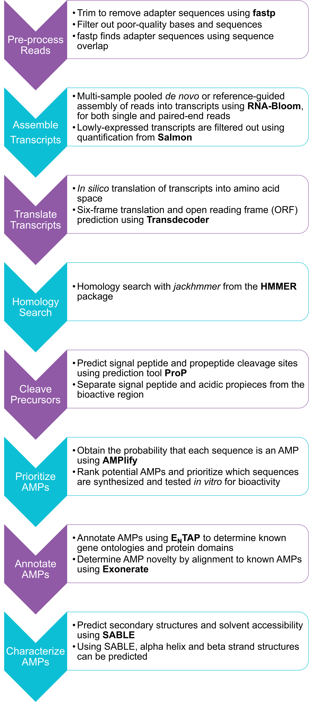

# r<span style='color:##FF0000'>AMP</span>age: Rapid AMP Annotation and Gene Estimation

Written by [Diana Lin](mailto:dlin@bcgsc.ca).


## Description

rAMPage is a _de novo_ anti-microbial peptide (AMP) discovery pipeline that takes in bulk RNA-seq reads and outputs a FASTA file of annotated, confident, short, and charged putative AMPs.



## Quick Links

1. [Setup](#setup)
1. [Dependencies](#dependencies)
	1. [Basics](#basics)
	1. [Tools](#tools)
	1. [Optional](#optional)
1. [Input](#input)
1. [Usage](#usage)
1. [Directory Structure](#directory-structure)
1. [Citation](#citation)


## Setup

1. Clone this repository:
	```
	git clone https://github.com/bcgsc/rAMPage.git
	```
1. Download and install the dependencies (specified in the [Dependencies](#dependencies) section below), into [`rAMPage/src`](src/).
	* some of these dependencies need to be configured: `SignalP`, `ProP`, `SABLE`, `E<sub>N</sub>TAP` (see [configurations](#configurations))
1. Update _all_ the paths in [`rAMPage/scripts/config.sh`](scripts/config.sh) to reflect dependencies in [`rAMPage/src`](src/) and dependencies pre-installed elsewhere.
1. Source [`scripts/config.sh`](scripts/config.sh) in the root of the repository.
	```shell
	cd rAMPage
	source scripts/config.sh
	```
1. Create working directories for each dataset using this convention: 
	`taxonomic-class/species/tissue-or-condition`
	- **NOTE**: the top-level parent directory _must_ correspond to the taxonomic class of the dataset. This class is used to choose which file in `amp_seqs` to use for homology search.
	- e.g. _M. gulosa_: `insecta/mgulosa/venom-gland`
	- e.g. _P. toftae_: `amphibia/ptoftae/skin-liver`
1. Move all reads and reference FASTA files to the respective working directories for each dataset. See below for an example.
1. Create a 2 or 3-column space-delimited text file as specified by the [Input](#input) section below, called `input.txt`, in the working directory of each dataset.

At the end of setup, you should have a directory structure similar to below (excludes other directories, like `scripts/`):

```
rAMPage
├── amphibia
│   └── ptoftae
│       └── skin-liver
│           ├── input.txt
│           └── raw_reads
│               ├── SRR8288040_1.fastq.gz
│               ├── SRR8288040_2.fastq.gz
│               ├── SRR8288041_1.fastq.gz
│               ├── SRR8288041_2.fastq.gz
│               ├── SRR8288056_1.fastq.gz
│               ├── SRR8288056_2.fastq.gz
│               ├── SRR8288057_1.fastq.gz
│               ├── SRR8288057_2.fastq.gz
│               ├── SRR8288058_1.fastq.gz
│               ├── SRR8288058_2.fastq.gz
│               ├── SRR8288059_1.fastq.gz
│               ├── SRR8288059_2.fastq.gz
│               ├── SRR8288060_1.fastq.gz
│               ├── SRR8288060_2.fastq.gz
│               ├── SRR8288061_1.fastq.gz
│               └── SRR8288061_2.fastq.gz
└── insecta
    └── mgulosa
        └── venom
            ├── input.txt
            ├── raw_reads
            │   ├── SRR6466797_1.fastq.gz
            │   └── SRR6466797_2.fastq.gz
            └── tsa.GGFG.1.fsa_nt.gz
```

## Dependencies

### Basics

|Dependency| Tested Version |
|----------|----------------|
| GNU `bash`| v5.0.11(1) |
| GNU `awk` | v5.0.1 |
| GNU `sed` | v4.8 |
| GNU `grep` | v3.4 |
| GNU `make` | v4.3 |
| GNU `column` | 2.36 |
| `bc` | v1.07.1 |
| `gzip` | v1.10|
| `python` | v3.7.7 |
<!-- - [ ] Perl v5.32.0 -->

### Tools

|Dependency| Tested Version |
|----------|----------------|
| [SRA toolkit](https://github.com/ncbi/sra-tools/releases/tag/2.10.5) | v2.10.5 |
| [EDirect](https://www.ncbi.nlm.nih.gov/books/NBK179288/) | v13.8 |
| [fastp](https://github.com/OpenGene/fastp/releases/tag/v0.20.0) | v0.20.0|
| [RNA-Bloom](https://github.com/bcgsc/RNA-Bloom/releases/tag/v1.3.1) |v1.3.1|
| [salmon](https://github.com/COMBINE-lab/salmon/releases/tag/v1.3.0) | v1.3.0 |
| [TransDecoder](https://github.com/TransDecoder/TransDecoder/releases/tag/TransDecoder-v5.5.0) |v5.5.0|
| [HMMER](https://github.com/EddyRivasLab/hmmer/releases/tag/hmmer-3.3.1) |v3.3.1|
| [cd-hit](https://github.com/weizhongli/cdhit/releases/tag/V4.8.1) | v4.8.1|
| [seqtk](https://github.com/lh3/seqtk/releases/tag/v1.1)| v1.1-r91 |
| [SignalP](https://services.healthtech.dtu.dk/services/SignalP-5.0/9-Downloads.php#) | v3.0
| [ProP](https://services.healthtech.dtu.dk/services/ProP-1.0/9-Downloads.php#) | v1.0c |
| [AMPlify](https://github.com/bcgsc/AMPlify/releases/tag/v1.0.0) |v1.0.0|
| [E<sub>N</sub>TAP](https://github.com/harta55/EnTAP/tree/v0.10.7-beta) | v0.10.7-beta|
| [Exonerate](https://www.ebi.ac.uk/about/vertebrate-genomics/software/exonerate) | v2.4.0|
| [SABLE](https://sourceforge.net/projects/meller-sable/) | v4.0 |

#### Configurations

##### Configuring SignalP

The file to edit is `src/signalp-3.0/signalp`: 

| Before | After |
|--------|-------|
|`SIGNALP=/usr/opt/signalp-3.0` | `SIGNALP=$ROOT_DIR/src/signalp-3.0`
| `AWK=nawk` | `AWK=awk`

##### Configuring ProP

The file to edit is `src/prop-1.0c/prop`:

| Before | After |
|--------|-------|
|`setenv	PROPHOME	/usr/cbs/packages/prop/1.0c/prop-1.0c` | `setenv	PROPHOME	$ROOT_DIR/src/prop-1.0c` |
|\*`setenv AWK /usr/bin/gawk` | `setenv AWK awk` |
|\*`setenv SIGNALP /usr/cbs/bio/bin/signalp` | `setenv SIGNALP $ROOT_DIR/src/signalp-3.0/signalp` |

\*edit the one corresponding to your system, Linux used in the example

##### Configuring E<sub>N</sub>TAP

Download **and** decompress the following [databases](https://entap.readthedocs.io/en/latest/Getting_Started/configuration.html):

| Database | Example Download Code | 
|---------------|------------------|
|RefSeq: Non-mammalian Vertebrates<br/>(for `amphibia`) | `wget -O vertebrate_other_protein.faa.gz ftp://ftp.ncbi.nlm.nih.gov/refseq/release/vertebrate_other/vertebrate_other.*.protein.faa.gz`
|RefSeq: Invertebrates<br/>(for `insecta`) | `wget -O invertebrate_protein.faa.gz ftp://ftp.ncbi.nlm.nih.gov/refseq/release/invertebrate/invertebrate.*.protein.faa.gz`|
| SwissProt  | `wget ftp://ftp.uniprot.org/pub/databases/uniprot/current_release/knowledgebase/complete/uniprot_sprot.fasta.gz` |
| NCBI `nr` | `wget -O nr.fasta.gz ftp://ftp.ncbi.nlm.nih.gov/blast/db/FASTA/nr.gz` |

After decompression, the databases can be configured using [`scripts/config-entap.sh`](scripts/config-entap.sh):

```
scripts/config-entap.sh -t 8 invertebrate.protein.faa vertebrate_other.protein.faa uniprot_sprot.fasta nr.fasta
```

The script configures all the databases in the `EnTAP-0.10.7-beta/bin` directory.

##### Configuring SABLE

The file to edit is `src/sable_v4_distr/run.sable`:

| Before | After |
|--------|-------|
|`remDir=$PWD;` | `remDir=$PWD; THREADS=$1;`
|`export SABLE_DIR="/users/radamcza/work/newSable/sable_distr";`| `export SABLE_DIR="$ROOT_DIR/src/sable_v4_distr";` |
| `export BLAST_DIR="/usr/local/blast/2.2.28/bin";` | `export BLAST_DIR=$BLAST_DIR` | 
|\*`export NR_DIR="/database/ncbi/nr"` | `export NR_DIR=$ROOT_DIR/src/EnTAP-0.10.7-beta/bin/nr` |
| `export PRIMARY_DATABASE="/users/radamcza/work/newSable/sable_distr/GI_indexes/pfam_index"` | `export PRIMARY_DATABASE="$ROOT_DIR/src/sable_v4_distr/GI_indexes/pfam_index"` | 
| `export SECONDARY_DATABASE="/users/radamcza/work/newSable/sable_distr/GI_indexes/swissprot_index"` | `export SECONDARY_DATABASE="$ROOT_DIR/src/sable_v4_distr/GI_indexes/swissprot_index";`
|`mkdir $PBS_JOBID` | `mkdir -p $PBS_JOBID`|
| `/usr/bin/perl ${SABLE_DIR}/sable.pl` | `perl ${SABLE_DIR}/sable.pl $THREADS` |

\*After downloading the `nr` FASTA file (see below), it will need to be configured using BLAST+'s `makeblastdb`.

### Optional

|Dependency| Tested Version |
|----------|----------------|
| GNU `wget` | v1.20.3|
| `curl` | v7.72.0 |
| [`pigz`](https://github.com/madler/pigz/releases/tag/v2.4) |v2.4 |

## Input

A 2 or 3-column space-delimited text file named `input.txt`, located in the working directory of each dataset.

| Column | Attribute |
|--------|-----------|
| 1 | Pooling ID: generally a condition, tissue, or sex, etc. |
| 2 | Path to read 1 |
| 3 | Path to read 2 (if paired-end reads) |

Read paths in this input text file should be relative to the location of the input text file.

_Need help downloading reads?_ The `scripts/helpers/get-reads.sh` script can be used to download reads. These dependencies are required:

|Dependency| Tested Version |
|----------|----------------|
| [SRA toolkit](https://github.com/ncbi/sra-tools/releases/tag/2.10.5)<br/> | v2.10.5 |
| [EDirect](https://www.ncbi.nlm.nih.gov/books/NBK179288/) | v13.8 |

The input `runs.txt` should have one _SRR_ accession on each line.

#### Example: _M. gulosa_

| POOLING ID | READ 1 | READ 2 |
|---------------------|--------|--------|
| venom | raw_reads/SRR6466797_1.fastq.gz | raw_reads/SRR6466797_2.fastq.gz |

`insecta/mgulosa/venom/input.txt`:

```
venom raw_reads/SRR6466797_1.fastq.gz raw_reads/SRR6466797_2.fastq.gz
```

Using `scripts/helpers/get-reads.sh`:

```
scripts/helpers/get-reads.sh -o insecta/mgulosa/venom/raw_reads -p insecta/mgulosa/venom/runs.txt
```

`insecta/mgulosa/venom/runs.txt`:

```
SRR6466797
```

#### Example: _P. toftae_

| POOLING ID | READ 1 | READ 2 |
|---------------------|--------|--------|
|liver|raw_reads/SRR8288040_1.fastq.gz|raw_reads/SRR8288040_2.fastq.gz|
|skin|raw_reads/SRR8288041_1.fastq.gz|raw_reads/SRR8288041_2.fastq.gz|
|liver|raw_reads/SRR8288056_1.fastq.gz|raw_reads/SRR8288056_2.fastq.gz|
|skin|raw_reads/SRR8288057_1.fastq.gz|raw_reads/SRR8288057_2.fastq.gz|
|liver|raw_reads/SRR8288058_1.fastq.gz|raw_reads/SRR8288058_2.fastq.gz|
|skin|raw_reads/SRR8288059_1.fastq.gz|raw_reads/SRR8288059_2.fastq.gz|
|liver|raw_reads/SRR8288060_1.fastq.gz|raw_reads/SRR8288060_2.fastq.gz|
|skin|raw_reads/SRR8288061_1.fastq.gz|raw_reads/SRR8288061_2.fastq.gz|

`amphibia/ptoftae/skin-liver/input.txt`:

```
liver raw_reads/SRR8288040_1.fastq.gz raw_reads/SRR8288040_2.fastq.gz
skin raw_reads/SRR8288041_1.fastq.gz raw_reads/SRR8288041_2.fastq.gz
liver raw_reads/SRR8288056_1.fastq.gz raw_reads/SRR8288056_2.fastq.gz
skin raw_reads/SRR8288057_1.fastq.gz raw_reads/SRR8288057_2.fastq.gz
liver raw_reads/SRR8288058_1.fastq.gz raw_reads/SRR8288058_2.fastq.gz
skin raw_reads/SRR8288059_1.fastq.gz raw_reads/SRR8288059_2.fastq.gz
liver raw_reads/SRR8288060_1.fastq.gz raw_reads/SRR8288060_2.fastq.gz
skin raw_reads/SRR8288061_1.fastq.gz raw_reads/SRR8288061_2.fastq.gz
```

Using `scripts/helpers/get-reads.sh`:

```
scripts/helpers/get-reads.sh -o amphibia/ptoftae/skin-liver/raw_reads -p amphibia/ptoftae/skin-liver/runs.txt
```

`amphibia/ptoftae/skin-liver/runs.txt`:

```
SRR8288040
SRR8288041
SRR8288056
SRR8288057
SRR8288058
SRR8288059
SRR8288060
SRR8288061
```

### Reference Transcriptomes

To use a reference transcriptome for the assembly stage with RNA-Bloom, put the reference in the working directory or use the `-r` option of `scripts/rAMPage.sh`.

```
insecta/mgulosa/venom
├── input.txt
├── raw_reads
│   ├── SRR6466797_1.fastq.gz
│   └── SRR6466797_2.fastq.gz
└── tsa.GGFG.1.fsa_nt.gzz
```

In this case, the reference transcriptome is a **Transcriptome Shotgun Assembly** for _M. gulosa_, downloaded from [`ftp://ftp.ncbi.nlm.nih.gov/genbank/tsa/G/tsa.GGFG.1.fsa_nt.gz`](ftp://ftp.ncbi.nlm.nih.gov/genbank/tsa/G/tsa.GGFG.1.fsa_nt.gz).

Multiple references can be used as long as they are placed in the working directory.

### Sources of References

**Representative Genomes** can be found by searching the Genome database on [NCBI](https://www.ncbi.nlm.nih.gov/genome/), using these search terms (_A. mellifera_, for example):

```
"Apis mellifera"[orgn]
```

**Transcriptome Shotgun Assemblies** can be found by searching the Nucleotide database on [NCBI](https://www.ncbi.nlm.nih.gov/nucleotide), using these search terms:

```
tsa-master[prop] "Apis mellifera"[orgn] midgut[All Fields]
```

## Usage

The `rAMPage.sh` script in `scripts/` runs the pipeline using a `Makefile`.

```
PROGRAM: rAMPage.sh

DESCRIPTION:
      Runs the rAMPage pipeline, using the Makefile.
      
USAGE(S):
      rAMPage.sh [-a <address>] [-c <taxonomic class>] [-d] [-n <species name>] [-p] [-r <FASTA.gz>] [-s] [-t <int>] [-o <output directory>] [-v] <input reads TXT file>
      
OPTIONS:
       -a <address>    email address for alerts                      
       -c <class>      taxonomic class of the dataset                (default = top-level directory in $outdir)
       -d              debug mode of Makefile                        
       -f              force characterization even if no AMPs found  
       -h              show help menu                                
       -m <target>     Makefile target                               (default = exonerate)
       -n <species>    taxnomic species or name of the dataset       (default = second-level directory in $outdir)
       -o <directory>  output directory                              (default = directory of input reads TXT file)
       -p              run processes in parallel                     
       -r <FASTA.gz>   reference transcriptome                       (accepted multiple times, *.fna.gz *.fsa_nt.gz)
       -s              strand-specific library construction          (default = false)
       -t <int>        number of threads                             (default = 48)
       -v              verbose (uses /usr/bin/time -pv)              
                                                                
EXAMPLE(S):
      rAMPage.sh -a user@example.com -c class -n species -p -s -t 8 -o /path/to/output/directory -r /path/to/reference.fna.gz -r /path/to/reference.fsa_nt.gz /path/to/input.txt 
      
INPUT EXAMPLE:
       tissue /path/to/readA_1.fastq.gz /path/to/readA_2.fastq.gz
       tissue /path/to/readB_1.fastq.gz /path/to/readB_2.fastq.gz
       
MAKEFILE TARGETS:
       01) check        08) homology
       02) reads        09) cleavage
       03) trim         10) amplify
       04) readslist    11) annotation
       05) assembly     12) exonerate
       06) filtering    13) sable
       07) translation  14) all
```

### Running from the root of the repository

Example: _M. gulosa_ (stranded library construction)

```shell
scripts/rAMPage.sh -v -s -o insecta/mgulosa/venom -r insecta/mgulosa/venom/tsa.GGFG.1.fsa_nt.gz -c insecta -n mgulosa insecta/mgulosa/venom/input.txt
```

In the example above, the `-o insecta/mgulosa/venom` argument is _optional_, since the default will be set as parent directory of the `input.txt` file. This option is a safeguard for the scenario where `input.txt` is _not_ located in the working directory. In this case, the `-o` option will move `input.txt` and provided references to the working directory.

rAMPage will use all `*.fsa_nt*` and `*.fna*` files located in the working directory as references in the assembly stage, _regardless of if the `-r` option is used or not._ This option is a safeguard for the scenario where the references provided are _not_ located in the working directory. In this case, the `-r` option will _move_ the references to the working directory.

### Running from the working directory of the dataset

Example: _M. gulosa_ (stranded library construction)

```shell
scripts/rAMPage.sh -s -r tsa.GGFG.1.fsa_nt.gz -c insecta -n mgulosa input.txt
```

### Running multiple datasets from the root of the repository

To run rAMPage on multiple datasets, you can use the `stAMPede.sh` wrapper script. By default, `stAMPede.sh` will run rAMPage on the datasets consecutively. If the `-s` option is invoked, they will be run simultaenously in parallel. The `-p` option allows parallelization of certain processes, such as trimming reads in parallel.

```
PROGRAM: stAMPede.sh

DESCRIPTION:
      A wrapper around rAMPage.sh to allow running of multiple assemblies.
      
USAGE(S):
      stAMPede.sh [-a <address>] [-d] [-h] [-m] [-p] [-s] [-t <int>] [-v] <accessions TXT file>
      
OPTION(S):
       -a <address>  email address for alerts                                   
       -d            debug mode                                                 
       -h            show help menu                                             
       -m <target>   Makefile target                                            (default = exonerate)
       -p            allow parallel processes for each dataset                  
       -s            simultaenously run rAMPAge on all datasets                 (default if SLURM available)
       -t <int>      number of threads                                          (default = 48)
       -v            verbose (uses /usr/bin/time -pv to time each rAMPage run)  
                                                                                
ACCESSIONS TXT FORMAT:
       CLASS/SPECIES/TISSUE_OR_CONDITION/input.txt strandedness
       amphibia/ptoftae/skin-liver/input.txt nonstranded
       insecta/mgulosa/venom/input.txt stranded
       
EXAMPLE(S):
      stAMPede.sh -a user@example.com -p -s -v accessions.txt
```

#### Input

For running multiple datasets, the multi-input text file should be a 2-column text file:

|Column|Attribute|
|------|---------|
| 1 | path to `input.txt` file |
| 2 | `stranded` or `nonstranded`|

Example: _P. toftae_ and _M. gulosa_

| `input.txt` | `strandedness` |
|-------------|----------------|
| `amphibia/ptoftae/skin-liver/input.txt` | `nonstranded` |
| `insecta/mgulosa/venom/input.txt` | `stranded` |

`multi-input.txt`:

```
amphibia/ptoftae/skin-liver/input.txt nonstranded
insecta/mgulosa/venom/input.txt stranded
```

## Directory Structure

Example directory structure:

```
rAMPage
├── amphibia
│   └── ptoftae
│       └── skin-liver
├── amp_seqs
├── insecta
│   └── mgulosa
│       └── venom
├── scripts
└── src
```

## Citation

rAMPage: Rapid AMP Annotation and Gene Estimation (2021). Diana Lin, Ka Ming Nip, Sambina Aninta, Chenkai Li, Rene L. Warren, Caren Helbing, Linda Hoang, Inanc Birol
